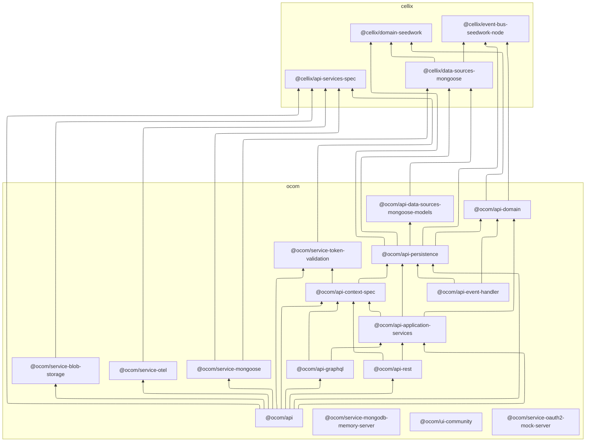

## CellixJS Monorepo

Domain-driven architecture for Azure Functions with GraphQL/REST, MongoDB (Mongoose), and OpenTelemetry. This repo contains the API app, domain, infrastructure, and local dev services.

## Prerequisites

- Node.js v22+
- VS Code (recommended) with Azurite extension for local Storage emulation
- npm v11+ (nvm recommended)

## First Time Setup

```bash
nvm install v22
nvm install-latest-npm
nvm use v22
npm run clean
npm install
npm run build
```

## Developer usage

- Full local dev (builds, starts Azurite, emulators, and the OwnerCommunity app):

  ```bash
  npm run dev
  ```

- Start only the API app:

  ```bash
  npm run start:api
  ```

- Start the UI (frontend):

  ```bash
  npm run start:ui-community
  ```

- Start emulators individually:

  ```bash
  # MongoDB in-memory replica set
  npm run start-emulator:mongo-memory-server

  # OAuth2/OIDC mock server
  npm run start-emulator:auth-server
  ```

## Scripts

- Build all workspaces: `npm run build`
- Lint all: `npm run lint`
- Format all: `npm run format`
- Tests: 
    - `npm run test`
    - `npm run test:coverage`
    - `npm run test:integration`
    - `npm run test:serenity`
    - `npm run test:unit`
    - `npm run test:watch` (typically run per workspace package)

## Decisions

- Architecture docs and ADRs in `docusaurus/decisions`

## VS Code tips

- Install recommend VSCode extensions for best developer experience.
- Use built-in tasks to run the Functions host and watch builds.

## Dependency Graph



## Recipe History

This section preserves prior setup notes and commands for reference as the repo evolved.

```bash
npm i -D concurrently

npm init -w ./packages/api-graphql
npm install @as-integrations/azure-functions @apollo/server graphql @azure/functions -w api-graphql

npm init -w ./packages/api-event-handler

npm init -w ./packages/api-services
npm init -w ./packages/api-rest
npm install @azure/functions -w api-rest

npm init -w ./packages/api-data-sources-domain

npm init -w ./packages/service-otel
npm install @azure/monitor-opentelemetry -w service-otel

npm init -w ./packages/api-persistence

npm init -w ./packages/event-bus-seedwork-node

npm install --save-dev @tsconfig/node20 @tsconfig/node-ts vitest @vitest/coverage-v8
```